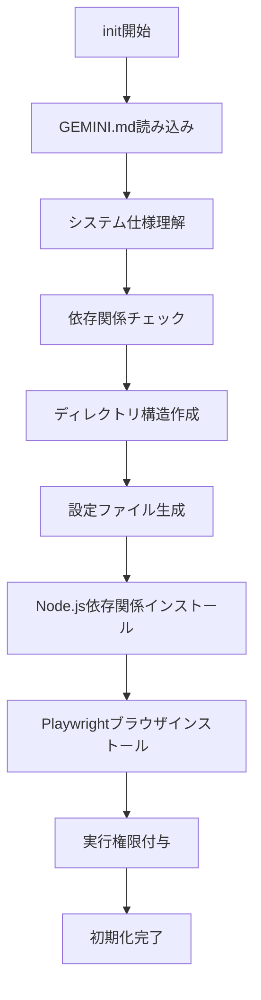

# WebTestAI - Gemini CLI システム仕様書

## 概要

このドキュメントは、Gemini CLIで`./web-test init`コマンドを実行する際に、システムの仕様と定義を理解するための初期読み込みドキュメントです。

## システムアーキテクチャ

### プロジェクト名
**WebTestAI** - AI駆動型Webテスト自動化フレームワーク

### 主要機能（2025-09 更新）
1. **AI自動テスト生成** - URLから最大50個のテストケースを自動生成
2. **可視要素解析** - 画面表示要素を座標順（左上→右下）で完全解析
3. **インテリジェントデータ生成** - プレースホルダー/ラベル/前後文脈からのダミー値生成（CLI/ルール）
4. **セキュリティテスト** - XSS/SQLを単一テスト内で「入力→送信→未発火確認」まで実行

## Gemini CLI統合仕様

### 設定パラメータ
```json
{
  "ai_cli_settings": {
    "gemini": {
      "enabled": true,
      "model": "gemini-2.5-pro",
      "timeout": 300,
      "auto_extend": true,
      "max_timeout": 3600
    }
  }
}
```

### 実行モード
- **対話型モード**: ユーザー入力を待機し、段階的に処理
- **バッチモード**: コマンドライン引数で一括実行
- **ヘッドレスモード**: GUIなしでバックグラウンド実行

## テストケース生成アルゴリズム

### 1. 可視要素収集（VisualElementCollector）

#### 要素の可視性判定基準
```javascript
function isElementVisible(element) {
  // サイズチェック
  if (rect.width === 0 || rect.height === 0) return false;
  
  // スタイルチェック
  if (style.display === 'none') return false;
  if (style.visibility === 'hidden') return false;
  if (style.opacity === '0') return false;
  
  // ビューポート内チェック
  if (rect.bottom < 0 || rect.top > window.innerHeight) return false;
  if (rect.right < 0 || rect.left > window.innerWidth) return false;
  
  return true;
}
```

#### 収集対象要素
- **インタラクティブ要素**: links, buttons, inputs, textareas, selects
- **選択要素**: checkboxes, radios
- **構造要素**: forms, tabs, accordions
- **コンテンツ要素**: images, icons, labels, headings, tables

### 2. テストデータ生成ロジック

#### プレースホルダー解析パターン
```javascript
const patterns = {
  email: /メール|mail|email/i,
  phone: /電話|tel|phone/i,
  name: /名前|氏名|name/i,
  password: /パスワード|password|pw/i,
  search: /検索|search|キーワード/i,
  date: /日付|date|年月日/i,
  url: /URL|url|リンク|link/i
};
```

#### サンプルデータ生成例
| フィールドタイプ | プレースホルダー例 | 生成データ |
|--------------|-----------------|-----------|
| メール | "例: user@example.com" | "test@example.com" |
| 名前 | "例: 田中太郎" | "田中太郎" |
| パスワード | "8桁以上の半角英数字" | "Pass1234" |
| 電話番号 | "例: 090-1234-5678" | "090-1234-5678" |
| 検索 | "商品名を入力" | "ノートパソコン" |

### 3. テストケース優先順位

1. **可視要素テスト** (Priority: HIGH)
   - 画面に表示されているすべての要素
   - ユーザーが直接操作可能な要素

2. **包括的テスト** (Priority: MEDIUM)
   - 正常系、異常系、境界値テスト
   - エラーハンドリング確認

3. **セキュリティテスト** (Priority: HIGH)
   - XSS攻撃（8パターン）
   - SQLインジェクション（7パターン）
   - CSRF、ディレクトリトラバーサル

## フォーム解析仕様

### フォーム目的の自動判定
```javascript
const formPurposes = {
  search: ['search', '検索', 'キーワード', '探す'],
  login: ['login', 'ログイン', 'signin', 'サインイン'],
  register: ['register', '登録', 'signup', 'サインアップ'],
  contact: ['contact', 'お問い合わせ', '連絡', 'inquiry'],
  subscribe: ['subscribe', '購読', 'newsletter', 'メルマガ']
};
```

### テストケース命名規則
- **形式**: `[カテゴリ]_[具体的な内容]`
- **例**: 
  - `検索フォーム_「ノートパソコン」で検索`
  - `ログインフォーム_正しい認証情報でログイン`
  - `お問い合わせフォーム_全項目入力して送信`

## セッション管理

### 認証状態の保持
- **保存先**: `config/auth-state.json`
- **使用方法**: Playwrightの`storageState`機能を利用
- **適用範囲**: テストケース生成から実行まで一貫して維持

### Cookie/LocalStorage管理
```javascript
const context = await browser.newContext({
  storageState: 'config/auth-state.json'
});
```

## エラーハンドリング

### タイムアウト処理
```javascript
try {
  await page.goto(url, { 
    waitUntil: 'domcontentloaded',
    timeout: 60000 
  });
} catch (error) {
  if (error.name === 'TimeoutError') {
    console.log('⚠️ ページ読み込みタイムアウト、解析を続行');
    // 部分的に読み込まれたページで処理継続
  }
}
```

### リトライメカニズム
- **初回タイムアウト**: 30秒
- **リトライ回数**: 2回
- **最大待機時間**: 60秒

## パフォーマンス最適化

### 並列処理
- **テスト実行**: 最大5並列
- **要素収集**: 非同期バッチ処理
- **スクリーンショット**: 必要時のみ取得

### メモリ管理
- **ページコンテキスト**: 使用後即座に解放
- **録画データ**: ストリーミング処理
- **レポート生成**: チャンク単位で出力

## 出力形式

### テストケースJSON構造
```json
{
  "test_id": "TC001",
  "testName": "検索フォーム_「ノートパソコン」で検索",
  "category": "フォーム",
  "type": "normal",
  "priority": "high",
  "target_url": "https://example.com",
  "prerequisites": "トップページを開く",
  "test_steps": [
    {
      "step": 1,
      "action": "fill",
      "selector": "#search-input",
      "value": "ノートパソコン",
      "description": "検索フィールドに入力"
    },
    {
      "step": 2,
      "action": "click",
      "selector": "#search-button",
      "description": "検索ボタンをクリック"
    }
  ],
  "test_data": {
    "search_keyword": "ノートパソコン"
  },
  "expectedResult": "「ノートパソコン」で検索が実行され、検索結果が表示される",
  "actualResult": "",
  "status": "pending"
}
```

## Gemini CLI特有の考慮事項

### プロンプトエンジニアリング
- **明確な指示**: 具体的で曖昧さのない命令
- **構造化出力**: JSON形式での応答を要求
- **文脈保持**: 会話履歴を考慮した応答生成

### レート制限対応
- **リクエスト間隔**: 最小1秒
- **バッチサイズ**: 最大10要素/リクエスト
- **エラー時**: 指数バックオフでリトライ

### モデル選択
- **推奨モデル**: gemini-2.5-pro（高精度・高速）
- **代替モデル**: gemini-1.5-flash（軽量・低コスト）

## ベストプラクティス

### テストケース作成
1. **具体的なテストデータ**: 「値を入力」ではなく「田中太郎と入力」
2. **明確な期待結果**: 「正常に動作」ではなく「エラーメッセージが表示されない」
3. **独立性確保**: 各テストケースは他に依存しない

### 実行効率化
1. **ヘッドレスモード活用**: CI/CD環境では必須
2. **並列実行**: 独立したテストは並列化
3. **キャッシュ活用**: 静的リソースはキャッシュ

### デバッグ支援
1. **詳細ログ出力**: `--verbose`オプション使用
2. **スクリーンショット**: エラー時自動取得
3. **実行トレース**: Playwright Traceビューア活用

## 初期化時の処理フロー



## サポート情報

### トラブルシューティング
- **問題**: Gemini APIエラー
  - **解決**: API キーの確認、レート制限チェック
  
- **問題**: テストケース生成が遅い
  - **解決**: `--headless`モード使用、並列度調整

### 参考リンク
- [Gemini API Documentation](https://ai.google.dev/docs)
- [Playwright Documentation](https://playwright.dev/docs/intro)
- [プロジェクトGitHub](https://github.com/your-username/AI-Powered-Web-Testing-Framework)

---

**Version**: 2.2.0  
**Last Updated**: 2024-08-28  
**Author**: WebTestAI Development Team
