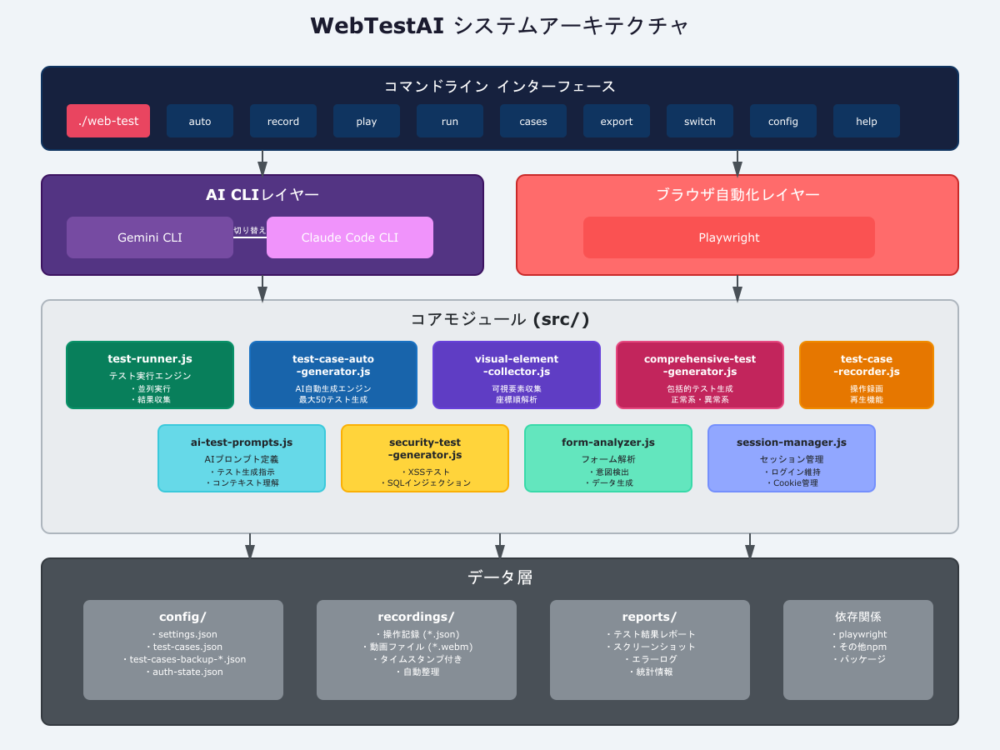
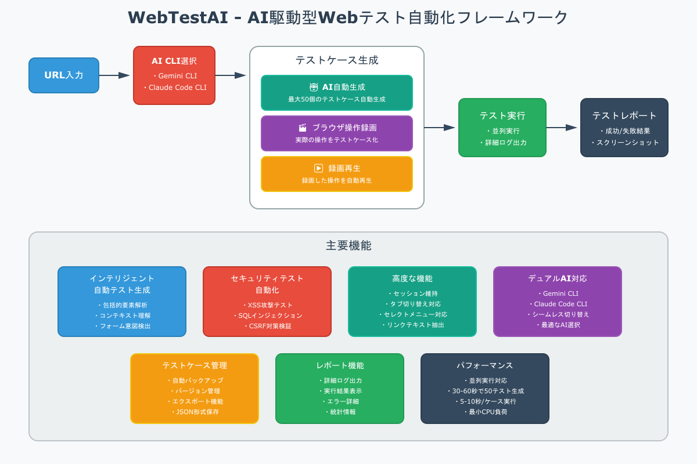
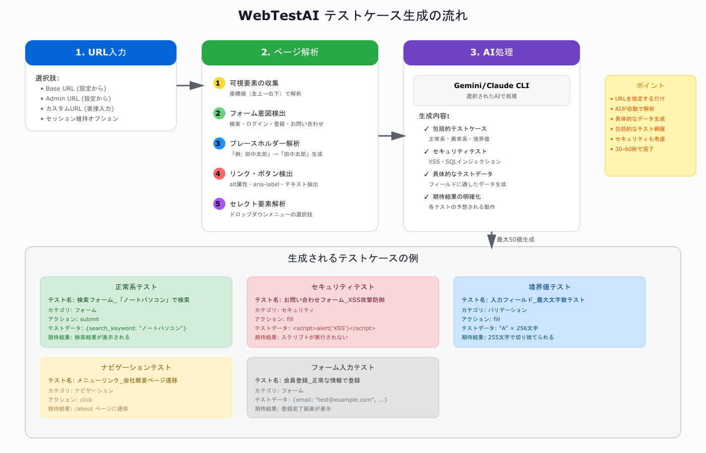

# WebTestAI - AI駆動型Webテスト自動化フレームワーク

[](https://opensource.org/licenses/MIT)
[](https://nodejs.org)
[](https://playwright.dev)

AI駆動の次世代Web自動テストフレームワーク。**URLを指定するだけ**で、AIが網羅的なテストケースを自動生成・実行します。

## 📸 スクリーンショット

### システムアーキテクチャ


### アーキテクチャ概要


### テスト生成フロー


## 🌟 主な特徴（2025-09 更新を含む）

### ✨ テストケースの最適化・レビュー (NEW! v2.3.0)
- **AI駆動型最適化** - 重複・無効なテストケースを自動削除
- **多様な最適化モード**:
  - 🚀 自動最適化 - AIによる包括的な最適化 + テストデータ自動改善
  - 📊 カテゴリ別 - 特定カテゴリのテストを最適化
  - 🎯 優先度別 - 優先度を再評価して最適化
  - 🔒 セキュリティ - セキュリティテストの重複を削除
  - 🗑️ クリーンアップ - 無効・重複テストを削除 + テストデータ自動改善
  - ✨ 完全レビュー - AI CLIで全テストケースを詳細レビュー
- **インテリジェントなテストデータ改善** (auto/cleanupモードで自動適用):
  - 検索キーワード: `山田太郎` → `ジェラート`（ECサイト）/`サービス`（一般サイト）
  - ログイン情報: 適切なメールアドレスとパスワードに自動変更
  - 登録フォーム: 実在する形式の住所、電話番号、名前に変更
  - テストケース名・期待結果も同時に更新
- **フィールド保護** - 前提条件、テスト手順、期待結果を確実に保持
- **インテリジェントフィルタリング** - 意味のないテストケースを自動除外
  - ページネーションボタン（button_1 of 3）
  - 価格表示のみの要素（p_￥1,200）
  - 日付表示（div_2018/09/01）
  - 汎用的な期待結果（a要素が正常に動作する）

### 🌐 マルチブラウザサポート
- **Chromium** - Google Chromeのベースエンジン
- **Firefox** - Mozilla Firefox
- **WebKit** - Safari/iOSのブラウザエンジン
- **クロスブラウザテスト** - 全ブラウザで一括実行可能
- **互換性分析** - ブラウザごとの結果を自動比較

### 🛒 EC-CUBE 4.2対応
- **自動検出** - EC-CUBEサイトを自動認識
- **専用解析** - 商品、カート、会員登録などEC特有の要素を解析
- **管理画面対応** - 商品管理、受注管理、会員管理をサポート
- **日本語テストデータ** - 名前、住所、電話番号などを自動生成

### 🤖 インテリジェント自動テスト生成
- **包括的要素解析** - ページ上のすべての可視要素を座標順（左上→右下）で体系的に解析
- **コンテキスト理解** - プレースホルダー、ラベル、入力フィールドの文脈を理解し、最適なテストデータを自動生成
- **フォーム意図検出** - 検索、ログイン、登録、お問い合わせなど、フォームの目的を自動判定
- **詳細な期待結果** - 「検索フォーム_「ノートパソコン」で検索」のような具体的なテストケース名と期待結果を生成

### 🔒 セキュリティテスト自動化（強化）
- **XSS攻撃テスト** - 8種類の攻撃パターンを自動テスト
  - `<script>alert("XSS")</script>` - 基本的なスクリプトインジェクション
  - `` - イメージタグを利用した攻撃
  - `javascript:alert("XSS")` - JavaScriptプロトコル攻撃
  - `<iframe src="javascript:alert('XSS')">` - iframeを利用した攻撃
  - `"><script>alert(String.fromCharCode(88,83,83))</script>` - エンコード回避攻撃
  - `<svg onload=alert("XSS")>` - SVGタグを利用した攻撃
  - `<body onload=alert("XSS")>` - イベントハンドラ攻撃
  - その他、実際の攻撃で使用される高度なパターン

- **SQLインジェクション** - 7種類の脆弱性パターンをチェック
  - `' OR '1'='1` - 認証バイパス攻撃
  - `1; DROP TABLE users--` - テーブル削除攻撃
  - `admin'--` - コメントアウト攻撃
  - `' OR 1=1--` - 条件句バイパス
  - `1' AND '1' = '1` - AND条件インジェクション
  - `'; DELETE FROM users; --` - 複数クエリ攻撃
  - `1 UNION SELECT * FROM users--` - UNION攻撃

- **CSRF対策検証** - トークンの有無と有効性を自動検証
- **入力検証** - 最大文字数、パターン検証、エスケープ処理を確認
- **一体型テスト** - XSS/SQLは「アクセス→フィールド待機→クリア→入力→送信→待機→ダイアログ未発火確認」を単一テストケースで実行

### ⚙️ クリックの安定化（safeClick）
- サブメニュー: 親liにhoverして可視化→クリック
- スライダー(slick/swiper): 可視スライド内のリンクを優先クリック、必要に応じてドラッグ
- フォールバック: 子孫/祖先a、テキスト一致、href直接遷移

### 🧠 入力データ推論（CLI/ルール両対応）
- placeholder/label/前後の文脈からダミー値を自動生成（CLIがあればAI、無ければルール）
- 検索キーワードは標準で「山田太郎」を入力、検索ボタン推定クリック＋遷移待機を付与

### 🧱 ステップ自動合成（NULL対策）
- リンク/セレクト/検索などで手順が不足する場合も、保存段階で最低限の手順を合成
- 例: 「1. アクセス → 2. クリック/選択 → 3. 遷移待機」

### 🎬 テスト作成の多様な方法
1. **AI自動生成** - URLを指定するだけで最大50個のテストケースを一括生成
2. **ブラウザ操作録画** - 実際の操作を録画してテストケース化
3. **録画再生** - 録画した操作を自動再生し、テストケースを生成

### 📊 高度な機能
- **セッション維持** - ログイン状態を維持したまま管理画面のテストケース生成が可能
- **タブ切り替え対応** - 同一ページ内のタブ切り替えもテスト対象
- **セレクトメニュー対応** - ドロップダウンメニューの選択操作も自動化
- **リンクテキスト抽出** - アンカータグ、画像alt属性、aria-labelなど複数の方法でリンク名を取得
- **カスタムURL優先** - settings.jsonよりもユーザー指定のURLを優先

### 🔄 デュアルAI対応
- **Gemini CLI** - Google AIとの統合
- **Claude Code CLI** - Anthropic AIとの統合
- シームレスな切り替えが可能

## 📋 動作環境

### 必須要件
- **OS**: Ubuntu 20.04 LTS 以降 (WSL2対応)
- **Node.js**: v18 以降
- **npm**: 8.0 以降

### AI CLI（いずれか1つ）
- [Gemini CLI](https://github.com/reugn/gemini-cli)
- [Claude Code CLI](https://github.com/anthropics/claude-cli)

## 🚀 クイックスタート

### 1. インストール

```bash
# リポジトリのクローン
git clone https://github.com/your-username/AI-Powered-Web-Testing-Framework.git
cd AI-Powered-Web-Testing-Framework/

# 重要: 初期設定（npm install含む）を必ず実行
chmod +x init.sh web-test
./init.sh

# または手動でセットアップする場合
npm install
npx playwright install
```

### 2. AI CLI設定

```bash
# 利用可能なCLIを確認
./web-test switch

# Gemini CLIに切り替え
./web-test switch gemini

# Claude CLIに切り替え  
./web-test switch claude
```

### 3. テストケース生成

#### 🤖 AI自動生成（推奨）

```bash
# 対話型で実行
./web-test auto
# → Base URL / Admin URL / カスタムURLから選択
# → ログイン状態維持オプションも選択可能

# URLを直接指定
./web-test auto --url https://example.com

# ヘッドレスモードで実行
./web-test auto --url https://example.com --headless

# Firefoxで生成
./web-test auto --url https://example.com --browser firefox

# EC-CUBEサイトの場合（自動検出）
./web-test auto --url http://localhost:8080
```

##### 生成される要素の優先順位
1. **可視要素テスト** - 画面に表示されているすべての要素を座標順に解析
2. **包括的テスト** - 正常系、異常系、境界値テストを網羅
3. **セキュリティテスト** - XSS、SQLインジェクション等の脆弱性チェック

#### 🎬 ブラウザ操作録画

```bash
# 録画開始
./web-test record

# URLを指定して録画
./web-test record --url https://example.com

# Firefoxで録画
./web-test record --url https://example.com --browser firefox

# WebKit(Safari)で録画
./web-test record --url https://example.com --browser webkit

# 録画終了: ブラウザを閉じるかCtrl+C
```

#### ▶️ 録画再生

```bash
# 録画ファイル一覧
./web-test play --list

# 特定ファイルを再生
./web-test play --file recording-2024-01-01.json

# 再生後、自動的にテストケース生成
./web-test play --file recording.json --auto-generate
```

### 4. テスト実行

```bash
# ファイル選択して実行
./web-test run

# 特定ファイルを指定
./web-test run --test-file test-cases-backup-2024.json

# デフォルトファイルで即実行
./web-test run --no-prompt

# Firefoxで実行
./web-test run --browser firefox

# WebKit(Safari)で実行
./web-test run --browser webkit

# 全ブラウザで実行（クロスブラウザテスト）
./web-test run --browser all

# EC-CUBEサイトの実行例
./web-test run --target EC-CUBE4.2サイト
```

### 5. テストケースの最適化

```bash
# 対話型で最適化モード選択
./web-test optimize

# 自動最適化（推奨）
./web-test optimize --mode auto --auto-save

# 重複・無効テスト削除
./web-test optimize --mode cleanup --auto-save

# カテゴリ別最適化
./web-test optimize --mode category

# 優先度別最適化
./web-test optimize --mode priority

# セキュリティテスト最適化
./web-test optimize --mode security

# 完全レビュー（AI CLIで詳細分析）
./web-test optimize --mode full

# CSVファイルから最適化
./web-test optimize exports/test-cases-export.csv
```

#### 最適化の実行例

```bash
$ ./web-test optimize --mode cleanup --auto-save

✅ 設定ファイルを読み込みました
✅ Gemini CLI 検出
✅ Claude Code CLI 検出

🔍 テストケースレビュー・最適化を開始

📋 117件のテストケースを分析中...

📌 モード: cleanup (コマンドラインから指定)

  🗑️  重複削除: フォーム_フォーム送信
  🗑️  無効削除: button_1 of 3
  🗑️  無効削除: p_￥1,200(税込)
  🗑️  無効削除: div_2018/09/01
  🗑️  汎用的期待結果削除: a要素が正常に動作する

📝 テストデータを改善中...
  ✏️ 検索_キーワード「山田太郎」 → 「ジェラート」
  ✏️ ログインフォーム → test@example.com / Test1234!
  ✏️ 会員登録フォーム → 適切な住所・電話番号

📈 最適化結果:
────────────────────────────────
元のテストケース数: 117
最適化後: 22
削減数: 95 (81%)
テストデータ改善: 8件
────────────────────────────────

✅ 最適化されたテストケースを保存しました
```

#### テストデータ改善の例

**改善前:**
```json
{
  "test_case_name": "検索_キーワード「山田太郎」の入力",
  "test_steps": [
    {
      "action": "fill",
      "value": "山田太郎",
      "description": "キーワードを入力に「山田太郎」を入力"
    }
  ],
  "expected_result": "「山田太郎」で検索される"
}
```

**改善後:**
```json
{
  "test_case_name": "検索_キーワード「ジェラート」の入力",
  "test_steps": [
    {
      "action": "fill",
      "value": "ジェラート",
      "description": "検索キーワード「ジェラート」を入力"
    }
  ],
  "expected_result": "「ジェラート」で検索される"
}
```

## 📊 テストケース生成例

### 具体的なテストデータを含むケース

```javascript
// フォーム入力テスト
{
  testName: "検索フォーム_「ノートパソコン」で検索",
  category: "フォーム",
  type: "normal",
  priority: "high",
  selector: "#search-form",
  action: "submit",
  test_data: {
    search_keyword: "ノートパソコン"
  },
  expectedResult: "「ノートパソコン」で検索が実行され、検索結果が表示される"
}

// XSSセキュリティテスト - 実際に注入される攻撃パターン例
{
  testName: "検索フォーム_XSS攻撃テスト_パターン1",
  category: "セキュリティ",
  type: "security",
  priority: "critical",
  selector: "#search-input",
  action: "fill",
  testData: "<script>alert('XSS')</script>",
  test_data: {
    attack_type: "XSS",
    pattern: "パターン1/8",
    payload: "<script>alert('XSS')</script>"
  },
  expectedResult: "XSS攻撃パターン1が防御される:\n" +
                 "- スクリプトが実行されない\n" +
                 "- アラートが表示されない\n" +
                 "- HTMLがエスケープされて表示される"
}

// SQLインジェクションテスト - 実際に注入される攻撃パターン例
{
  testName: "ログインフォーム_SQLインジェクション攻撃テスト_パターン1",
  category: "セキュリティ",
  type: "security",
  priority: "critical",
  selector: "#username",
  action: "fill",
  testData: "' OR '1'='1",
  test_data: {
    attack_type: "SQL_INJECTION",
    pattern: "パターン1/7",
    payload: "' OR '1'='1"
  },
  expectedResult: "SQLインジェクション攻撃パターン1が防御される:\n" +
                 "- SQLエラーが表示されない\n" +
                 "- データベースエラーが露出しない\n" +
                 "- 不正なクエリが実行されない\n" +
                 "- 適切なエラーメッセージが表示される"
}
```

### プレースホルダー解析によるデータ生成

```javascript
// プレースホルダー: "例: 田中太郎"
// → 生成データ: "田中太郎"

// プレースホルダー: "メールアドレス (例: user@example.com)"
// → 生成データ: "test@example.com"

// プレースホルダー: "8桁以上の半角英数字"
// → 生成データ: "Pass1234"
```

## 🛡️ セキュリティテスト実装詳細

### 自動生成されるセキュリティテストケース

WebTestAIは、各フォームに対して以下のセキュリティテストを自動生成します：

#### XSS攻撃テスト（全8パターン）
1. **基本スクリプトインジェクション**: `<script>alert("XSS")</script>`
2. **イメージタグ攻撃**: ``
3. **JavaScriptプロトコル**: `javascript:alert("XSS")`
4. **iframe攻撃**: `<iframe src="javascript:alert('XSS')">`
5. **エンコード回避**: `"><script>alert(String.fromCharCode(88,83,83))</script>`
6. **SVGタグ攻撃**: `<svg onload=alert("XSS")>`
7. **イベントハンドラ**: `<body onload=alert("XSS")>`
8. **その他の高度なパターン**

#### SQLインジェクション攻撃テスト（全7パターン）
1. **認証バイパス**: `' OR '1'='1`
2. **テーブル削除**: `1; DROP TABLE users--`
3. **コメントアウト**: `admin'--`
4. **条件句バイパス**: `' OR 1=1--`
5. **AND条件**: `1' AND '1' = '1`
6. **複数クエリ**: `'; DELETE FROM users; --`
7. **UNION攻撃**: `1 UNION SELECT * FROM users--`

### テスト実行時の動作

```bash
# セキュリティテストを含むテスト実行
./web-test run

# 実行中の表示例：
🔄 テスト TC025: 検索フォーム_XSS攻撃テスト_パターン1
  💉 攻撃ペイロード注入: <script>alert("XSS")</script>
  ✅ スクリプトが実行されませんでした
  ✅ HTMLがエスケープされて表示されました

🔄 テスト TC032: ログインフォーム_SQLインジェクション攻撃テスト_パターン1
  💉 攻撃ペイロード注入: ' OR '1'='1
  ✅ SQLエラーが表示されませんでした
  ✅ 不正なログインがブロックされました
```

## 🔧 高度な機能

### クロスブラウザテスト

```bash
# 全ブラウザで一括実行
./web-test run --browser all

# 実行結果例:
📊 クロスブラウザテスト結果サマリー
════════════════════════════════════════════════════════════

✅ CHROMIUM   
   成功: 45/50
   失敗: 3
   エラー: 2
   成功率: 90%

⚠️ FIREFOX    
   成功: 43/50
   失敗: 5
   エラー: 2
   成功率: 86%

✅ WEBKIT     
   成功: 44/50
   失敗: 4
   エラー: 2
   成功率: 88%

🔍 ブラウザ互換性分析
────────────────────────────────────
✅ 全ブラウザ成功: 42件
⚠️  一部ブラウザで失敗: 6件
   - 検索フォーム_詳細検索
   - ドロップダウンメニュー選択
   他 4件...
```

### EC-CUBEサイトの解析

```bash
# EC-CUBEサイトは自動検出
./web-test auto --url http://localhost:8080

# 実行時の表示:
🛒 EC-CUBE FRONT_TOP ページを検出しました

推奨テストシナリオ:
  1. 商品検索
     - 検索ボックスに入力
     - 検索実行
     - 結果確認
  2. カテゴリ遷移
     - カテゴリメニュー選択
     - 商品一覧表示確認
  3. カート確認
     - カートアイコンクリック
     - カート内容確認

# 管理画面の場合
🛒 EC-CUBE ADMIN_PRODUCT ページを検出しました

推奨テストシナリオ:
  1. 商品登録
     - 新規登録
     - 必須項目入力
     - 保存
```

### 認証付きページのテスト

```bash
./web-test auto
# 1. Admin URLを選択
# 2. セッション維持: Yes
# 3. ブラウザで手動ログイン
# 4. Enterキーで続行
# → ログイン後のページでテストケース生成
```

### 実行時の詳細ログ

テスト実行時、以下の情報がCLIに表示されます：

```
🔄 ステップ 1/3: 入力テスト_検索フィールド
  セレクタ: #search
  アクション: fill
  入力値: ノートパソコン
  ✅ ステップ完了
```

### テストファイル管理

```bash
# 自動バックアップ機能
test-cases.json → test-cases-backup-YYYY-MM-DD-HH-mm-ss.json

# バージョン選択
./web-test run
> test-cases.json (最新)
  test-cases-backup-2024-01-01.json
  test-cases-backup-2023-12-31.json
```

## 📂 プロジェクト構成

```
AI-Powered-Web-Testing-Framework/
├── web-test                            # メインコマンド
├── init.sh                             # 初期設定スクリプト
├── GEMINI.md                           # Gemini CLI用仕様書
├── claude.md                           # Claude Code CLI用仕様書
├── config/
│   ├── settings.json                   # プロジェクト設定
│   ├── test-cases.json                 # 現在のテストケース
│   ├── test-cases-backup-*.json        # バックアップ
│   └── auth-state.json                 # 認証状態（自動生成）
├── src/
│   ├── test-runner.js                  # テスト実行エンジン
│   ├── test-case-auto-generator.js     # AI自動生成エンジン
│   ├── test-case-optimizer.js          # テストケース最適化エンジン
│   ├── visual-element-collector.js     # 可視要素収集エンジン
│   ├── comprehensive-test-generator.js # 包括的テスト生成
│   ├── eccube-analyzer.js              # EC-CUBE専用解析エンジン
│   ├── test-case-recorder.js           # 録画・再生機能
│   └── ai-test-prompts.js              # AIプロンプト定義
├── recordings/                         # 録画データ
│   ├── *.json                          # 操作記録
│   └── *.webm                          # 動画ファイル
└── reports/                            # テストレポート
```

## 📝 コマンドリファレンス

### 基本コマンド

| コマンド | 説明 | 使用例 |
|---------|------|--------|
| `auto` | AI自動テスト生成 | `./web-test auto --url https://example.com` |
| `record` | ブラウザ操作録画 | `./web-test record` |
| `play` | 録画再生 | `./web-test play --file recording.json` |
| `run` | テスト実行 | `./web-test run` |
| `optimize` | テストケース最適化 | `./web-test optimize --mode auto` |
| `cases` | テストケース管理 | `./web-test cases --list` |
| `export` | エクスポート | `./web-test export --format json` |
| `switch` | AI CLI切り替え | `./web-test switch gemini` |
| `config` | 設定画面 | `./web-test config` |
| `help` | ヘルプ表示 | `./web-test help` |

### オプション一覧

#### auto (AI自動生成)
- `--url <URL>` - 解析するURL
- `--headless` - ヘッドレスモード
- `--cli <type>` - AI CLI選択 (gemini|claude|auto)
- `--browser <type>` - ブラウザ選択 (chromium|firefox|webkit)

#### run (テスト実行)
- `--test-file <file>` - テストファイル指定
- `--cases <IDs>` - 特定ケースのみ実行
- `--no-prompt` - プロンプトスキップ
- `--parallel <num>` - 並列実行数
- `--browser <type>` - ブラウザ選択 (chromium|firefox|webkit|all)

#### optimize (テストケース最適化)
- `--mode <mode>` - 最適化モード (auto|category|priority|security|cleanup|full)
- `--cli <type>` - AI CLI選択 (gemini|claude|auto)
- `--auto-save` - 自動保存（確認プロンプトをスキップ）

#### record (録画)
- `--url <URL>` - 開始URL
- `--video` - ビデオ録画有効化
- `--browser <type>` - ブラウザ選択 (chromium|firefox|webkit)

#### play (再生)
- `--list` - ファイル一覧表示
- `--file <file>` - ファイル指定
- `--speed <num>` - 再生速度 (0.5-5)
- `--auto-generate` - 自動テスト生成

## 🔍 トラブルシューティング

### よくある問題と解決方法

| 問題 | 原因 | 解決方法 |
|------|------|---------|
| Playwright依存関係エラー | システムパッケージ不足 | `sudo npx playwright install-deps` |
| タイムアウトエラー | 重いサイトの読み込み | 自動的にdomcontentloadedで処理継続 |
| リンクテキストが取れない | 複雑なHTML構造 | 複数の抽出方法で自動対応済み |
| カスタムURLが反映されない | 設定の優先順位 | v2.1で修正済み（カスタムURL優先） |
| フォームのテストデータが空 | コンテキスト理解不足 | プレースホルダー解析機能で改善済み |

### 日本語環境での注意点

WSL2で日本語が文字化けする場合：

```bash
sudo apt install fonts-noto-cjk
export LANG=ja_JP.UTF-8
```

## 📊 パフォーマンス指標

| 機能 | 処理時間 | 備考 |
|------|---------|------|
| AI自動生成 | 30-60秒 | 最大50個のテストケース |
| 可視要素解析 | 5-10秒 | ページの複雑さによる |
| 操作録画 | リアルタイム | CPU負荷は最小 |
| テスト実行 | 5-10秒/ケース | 並列実行で高速化可能 |

## 🤝 貢献ガイドライン

プロジェクトへの貢献を歓迎します！

1. このリポジトリをFork
2. Feature Branchを作成 (`git checkout -b feature/AmazingFeature`)
3. 変更をCommit (`git commit -m 'Add some AmazingFeature'`)
4. BranchをPush (`git push origin feature/AmazingFeature`)
5. Pull Requestを作成

詳細は[CONTRIBUTING.md](CONTRIBUTING.md)をご覧ください。

## 📄 ライセンス

MIT License - 詳細は[LICENSE](LICENSE)ファイルをご覧ください。

## 🙏 謝辞

- [Playwright](https://playwright.dev) - ブラウザ自動化フレームワーク
- [Gemini CLI](https://github.com/reugn/gemini-cli) - Google AI統合
- [Claude Code CLI](https://github.com/anthropics/claude-cli) - Anthropic AI統合

## 📧 サポート

問題や質問がある場合は、[Issues](https://github.com/your-username/AI-Powered-Web-Testing-Framework/issues)でお知らせください。

---

**最新バージョン: v2.3.1**  
主な更新内容：
- **インテリジェントなテストデータ改善機能**
  - 検索キーワードの自動最適化（人名→商品名/サービス名）
  - ログイン・登録フォームのリアルなテストデータ生成
  - テストケース名と期待結果の同時更新
- **日本時間（JST）対応**
  - すべてのタイムスタンプをJST形式で保存
  - 作成日時・更新日時の正確な記録
- **より厳密なフィルタリング**
  - 汎用的な期待結果（`要素が正常に動作する`）の削除
  - ステップ数が少ない無意味なテストの除外

**v2.3.0からの改善点**：
- テストデータ改善機能（auto/cleanupモードで自動適用）
- JST対応による正確な日時管理
- より実用的なテストケース生成

**v2.2.0からの主な改善点**：
- EC-CUBE自動生成時の無効テストケース削減（81%削減達成）
- NULL値の自動補完機能
- より賢いテストケース判定ロジック
