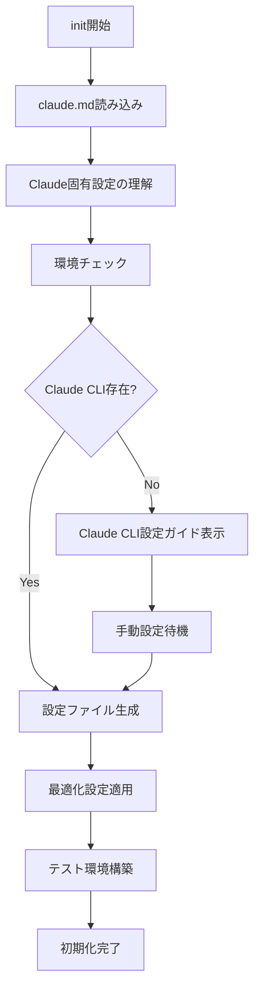

# WebTestAI - Claude Code CLI システム仕様書

## 概要

このドキュメントは、Claude Code CLIで`./web-test init`コマンドを実行する際に、システムの仕様と定義を理解するための初期読み込みドキュメントです。

## システムアーキテクチャ

### プロジェクト名
**WebTestAI** - AI駆動型Webテスト自動化フレームワーク

### コア機能（2025-09 更新）
1. **インテリジェント要素解析** - DOM要素の可視性と操作可能性を高精度で判定
2. **コンテキスト理解型データ生成** - placeholder/label/前後文脈からのダミー値生成（CLI/ルール）
3. **適応型テスト戦略** - ページ構造に応じた最適なテスト手法の自動選択
4. **包括的セキュリティ検証** - XSS/SQLを単一テストで「入力→送信→未発火確認」まで実行（OWASP Top 10に準拠）

## Claude Code CLI統合仕様

### 設定構成
```json
{
  "ai_cli_settings": {
    "claude": {
      "enabled": true,
      "model": "claude-sonnet-4",
      "timeout": 300,
      "auto_extend": true,
      "max_timeout": 3600,
      "context_window": 200000,
      "temperature": 0.7
    }
  }
}
```

### Claude特有の処理最適化
- **大規模コンテキスト処理**: 200kトークンまでの長文解析
- **構造化思考**: Chain-of-Thought推論による複雑なテストシナリオ生成
- **安全性重視**: 有害な入力の自動フィルタリング

## 高度なテストケース生成

### 1. 視覚要素収集システム（VisualElementCollector）

#### 多層的可視性判定
```javascript
class VisualElementCollector {
  isElementVisible(element) {
    // 1. 物理的可視性
    const rect = element.getBoundingClientRect();
    if (!this.isInViewport(rect)) return false;
    
    // 2. スタイル可視性
    const style = window.getComputedStyle(element);
    if (!this.isStyleVisible(style)) return false;
    
    // 3. 親要素の可視性（再帰的チェック）
    if (!this.isParentVisible(element.parentElement)) return false;
    
    // 4. z-index層の確認
    if (this.isObscuredByOtherElement(element)) return false;
    
    return true;
  }
}
```

#### 要素分類と優先度付け
```javascript
const elementPriority = {
  critical: ['submit', 'login', 'payment', 'checkout'],
  high: ['search', 'navigation', 'filter', 'sort'],
  medium: ['information', 'display', 'content'],
  low: ['decoration', 'footer', 'copyright']
};
```

### 2. セマンティック解析エンジン

#### フィールド意味理解
```javascript
const semanticAnalysis = {
  // 日本語パターン認識
  japanese: {
    name: /(?:氏名|名前|お名前|姓名|フルネーム)/,
    email: /(?:メール|電子メール|Eメール|連絡先)/,
    phone: /(?:電話|携帯|連絡先番号|TEL)/,
    address: /(?:住所|所在地|お届け先|配送先)/
  },
  
  // 文脈ベースの推論
  contextual: {
    analyzeLabel: (label, placeholder, nearbyText) => {
      // Claudeの自然言語理解を活用
      return inferFieldPurpose(label, placeholder, nearbyText);
    }
  }
};
```

#### インテリジェントデータ生成
```javascript
function generateTestData(field) {
  const context = analyzeFieldContext(field);
  
  switch(context.type) {
    case 'japanese_name':
      return generateJapaneseName(); // 山田太郎、佐藤花子など
    
    case 'postal_code':
      return generateValidPostalCode(); // 123-4567形式
    
    case 'credit_card':
      return generateTestCreditCard(); // テスト用番号
    
    case 'business_hours':
      return generateBusinessHours(); // 9:00-18:00形式
    
    default:
      return generateContextualData(context);
  }
}
```

### 3. テストシナリオ生成戦略

#### ページタイプ別アプローチ
```javascript
const pageStrategies = {
  'e-commerce': {
    focus: ['cart', 'checkout', 'payment', 'inventory'],
    scenarios: ['購入フロー', '在庫切れ処理', 'クーポン適用']
  },
  
  'authentication': {
    focus: ['login', 'register', 'password-reset', 'mfa'],
    scenarios: ['正常ログイン', 'アカウントロック', '2段階認証']
  },
  
  'search': {
    focus: ['query', 'filters', 'sorting', 'pagination'],
    scenarios: ['キーワード検索', '絞り込み', '0件ヒット処理']
  },
  
  'form': {
    focus: ['validation', 'submission', 'error-handling'],
    scenarios: ['全項目入力', '必須項目のみ', 'バリデーションエラー']
  }
};
```

## フォーム解析の高度化

### 多言語フォーム対応
```javascript
const formAnalyzer = {
  detectLanguage(form) {
    // テキスト内容から言語を自動判定
    const texts = extractAllTexts(form);
    return detectLanguageFromTexts(texts);
  },
  
  generateLocalizedData(language, fieldType) {
    switch(language) {
      case 'ja':
        return japaneseDataGenerator(fieldType);
      case 'en':
        return englishDataGenerator(fieldType);
      case 'zh':
        return chineseDataGenerator(fieldType);
    }
  }
};
```

### 複雑なフォーム構造の理解
```javascript
const complexFormHandler = {
  // 動的フォーム（条件付き表示）
  handleDynamicFields(form) {
    const dependencies = detectFieldDependencies(form);
    return generateConditionalTestCases(dependencies);
  },
  
  // マルチステップフォーム
  handleMultiStep(form) {
    const steps = detectFormSteps(form);
    return generateStepwiseTestCases(steps);
  },
  
  // 繰り返しフィールド（動的追加）
  handleRepeatingFields(form) {
    const repeaters = detectRepeatingPatterns(form);
    return generateDynamicFieldTestCases(repeaters);
  }
};
```

## セキュリティテストの詳細仕様

### OWASP Top 10対応
```javascript
const securityTests = {
  injection: {
    sql: [
      "' OR '1'='1",
      "'; DROP TABLE users--",
      "1' UNION SELECT * FROM passwords--"
    ],
    nosql: [
      '{"$gt": ""}',
      '{"$ne": null}',
      '{"$regex": ".*"}'
    ],
    ldap: [
      "*)(uid=*",
      "*)(|(uid=*))",
      "admin)(&(password=*))"
    ]
  },
  
  xss: {
    reflected: [
      "<script>alert('XSS')</script>",
      "",
      "javascript:alert('XSS')"
    ],
    stored: [
      "<svg onload=alert('XSS')>",
      "<iframe src=javascript:alert('XSS')>",
      "<body onload=alert('XSS')>"
    ],
    dom: [
      "#<script>alert('XSS')</script>",
      "?default=<script>alert('XSS')</script>"
    ]
  },
  
  authentication: {
    bruteforce: generateBruteforcePatterns(),
    sessionFixation: generateSessionTests(),
    privilegeEscalation: generatePrivilegeTests()
  }
};
```

### 脆弱性検出と報告
```javascript
class SecurityAnalyzer {
  async analyzeVulnerabilities(page) {
    const vulnerabilities = [];
    
    // CSRFトークンチェック
    if (!await this.hasCSRFProtection(page)) {
      vulnerabilities.push({
        type: 'CSRF',
        severity: 'HIGH',
        description: 'CSRFトークンが見つかりません',
        recommendation: 'フォームにCSRFトークンを実装してください'
      });
    }
    
    // HTTPSチェック
    if (!await this.isUsingHTTPS(page)) {
      vulnerabilities.push({
        type: 'INSECURE_TRANSMISSION',
        severity: 'CRITICAL',
        description: 'HTTPで通信しています',
        recommendation: 'HTTPSを使用してください'
      });
    }
    
    return vulnerabilities;
  }
}
```

## セッション管理の高度化

### 認証状態の詳細管理
```javascript
const sessionManager = {
  async saveAuthState(page) {
    const state = {
      cookies: await page.context().cookies(),
      localStorage: await page.evaluate(() => ({...localStorage})),
      sessionStorage: await page.evaluate(() => ({...sessionStorage})),
      timestamp: new Date().toISOString(),
      url: page.url()
    };
    
    await fs.writeJSON('config/auth-state.json', state);
  },
  
  async restoreAuthState(context) {
    const state = await fs.readJSON('config/auth-state.json');
    
    // 有効期限チェック
    if (this.isExpired(state.timestamp)) {
      throw new Error('認証状態が期限切れです');
    }
    
    await context.addCookies(state.cookies);
    await context.addInitScript(state => {
      Object.entries(state.localStorage).forEach(([key, value]) => {
        localStorage.setItem(key, value);
      });
    }, state);
  }
};
```

## パフォーマンス最適化

### Claude固有の最適化
```javascript
const claudeOptimization = {
  // バッチ処理の最適化
  batchProcessing: {
    maxBatchSize: 25,  // Claudeの処理能力に最適化
    processingDelay: 500,  // ミリ秒
    parallelRequests: 3
  },
  
  // コンテキスト管理
  contextManagement: {
    pruneOldContext: true,
    maxContextSize: 150000,  // トークン
    summarizeThreshold: 100000
  },
  
  // レスポンスキャッシング
  caching: {
    enabled: true,
    ttl: 3600,  // 秒
    maxCacheSize: '100MB'
  }
};
```

### メモリ効率化
```javascript
class MemoryOptimizer {
  constructor() {
    this.threshold = 500 * 1024 * 1024; // 500MB
  }
  
  async optimizeIfNeeded() {
    const usage = process.memoryUsage();
    
    if (usage.heapUsed > this.threshold) {
      await this.cleanup();
      global.gc && global.gc();  // 明示的GC
    }
  }
  
  async cleanup() {
    // 不要なオブジェクトの解放
    this.clearCache();
    this.releaseUnusedContexts();
    this.compactTestResults();
  }
}
```

## エラーハンドリングと復旧

### 段階的エラー処理
```javascript
const errorHandler = {
  async handleError(error, context) {
    const strategy = this.determineStrategy(error);
    
    switch(strategy) {
      case 'RETRY':
        return await this.retryWithBackoff(context);
      
      case 'FALLBACK':
        return await this.useFallbackMethod(context);
      
      case 'PARTIAL':
        return await this.continueWithPartialData(context);
      
      case 'ABORT':
        throw new CriticalError(error);
    }
  },
  
  determineStrategy(error) {
    if (error.name === 'TimeoutError') return 'RETRY';
    if (error.name === 'NetworkError') return 'FALLBACK';
    if (error.name === 'PartialLoadError') return 'PARTIAL';
    return 'ABORT';
  }
};
```

## 出力とレポート

### 詳細なテストレポート生成
```javascript
const reportGenerator = {
  async generateDetailedReport(results) {
    return {
      summary: {
        total: results.length,
        passed: results.filter(r => r.status === 'passed').length,
        failed: results.filter(r => r.status === 'failed').length,
        skipped: results.filter(r => r.status === 'skipped').length,
        executionTime: calculateTotalTime(results)
      },
      
      coverage: {
        elements: calculateElementCoverage(results),
        interactions: calculateInteractionCoverage(results),
        pages: calculatePageCoverage(results),
        security: calculateSecurityCoverage(results)
      },
      
      details: results.map(r => ({
        ...r,
        screenshots: r.screenshots || [],
        logs: r.logs || [],
        recommendations: generateRecommendations(r)
      })),
      
      insights: {
        criticalIssues: identifyCriticalIssues(results),
        performanceBottlenecks: identifyBottlenecks(results),
        securityVulnerabilities: identifyVulnerabilities(results),
        accessibilityIssues: identifyA11yIssues(results)
      }
    };
  }
};
```

## Claude Code CLI特有の機能

### 自然言語インターフェース
```javascript
const nlInterface = {
  async processUserIntent(input) {
    // ユーザーの意図を理解
    const intent = await this.analyzeIntent(input);
    
    // 適切なアクションに変換
    const actions = await this.mapIntentToActions(intent);
    
    // 確認と実行
    if (await this.confirmWithUser(actions)) {
      return await this.executeActions(actions);
    }
  }
};
```

### 学習と改善
```javascript
const learningEngine = {
  async learnFromResults(testResults) {
    // パターン認識
    const patterns = this.identifyPatterns(testResults);
    
    // 改善提案の生成
    const improvements = this.generateImprovements(patterns);
    
    // フィードバックループ
    await this.updateTestStrategies(improvements);
  }
};
```

## ベストプラクティス

### Claude Code CLIでの推奨事項

1. **明確なプロンプト設計**
   - 具体的な指示と期待される出力形式を明記
   - 日本語での指示も高精度で理解可能

2. **コンテキスト管理**
   - 長大なコンテキストを活用した複雑なテストシナリオ
   - 不要な情報は適切にプルーニング

3. **安全性の確保**
   - 有害な入力の自動検出とフィルタリング
   - プライバシー情報の適切な処理

4. **効率的な実行**
   - バッチ処理による高速化
   - 適切なキャッシング戦略

## トラブルシューティング

### よくある問題と解決策

| 問題 | 原因 | 解決方法 |
|------|------|----------|
| レスポンスが遅い | 大規模コンテキスト | コンテキストのプルーニングを有効化 |
| メモリ不足 | 大量のテストケース | バッチサイズを調整 |
| タイムアウト | 複雑なページ構造 | 段階的な解析戦略を使用 |
| 不正確な要素検出 | 動的コンテンツ | 待機時間を調整 |

## システム要件

### 推奨環境
- **OS**: Ubuntu 20.04 LTS以降 / WSL2
- **メモリ**: 8GB以上（推奨16GB）
- **CPU**: 4コア以上
- **ストレージ**: 10GB以上の空き容量

### 依存関係
- Node.js v18以降
- Playwright最新版
- Claude Code CLI最新版

## 初期化フロー



## サポートリソース

### ドキュメント
- [Claude API Documentation](https://docs.anthropic.com)
- [Playwright Documentation](https://playwright.dev)
- [プロジェクトWiki](https://github.com/your-username/AI-Powered-Web-Testing-Framework/wiki)

### コミュニティ
- [Discord Server](https://discord.gg/webtestai)
- [Stack Overflow Tag](https://stackoverflow.com/questions/tagged/webtestai)

---

**Version**: 2.2.0  
**Last Updated**: 2024-08-28  
**Author**: WebTestAI Development Team  
**License**: MIT
